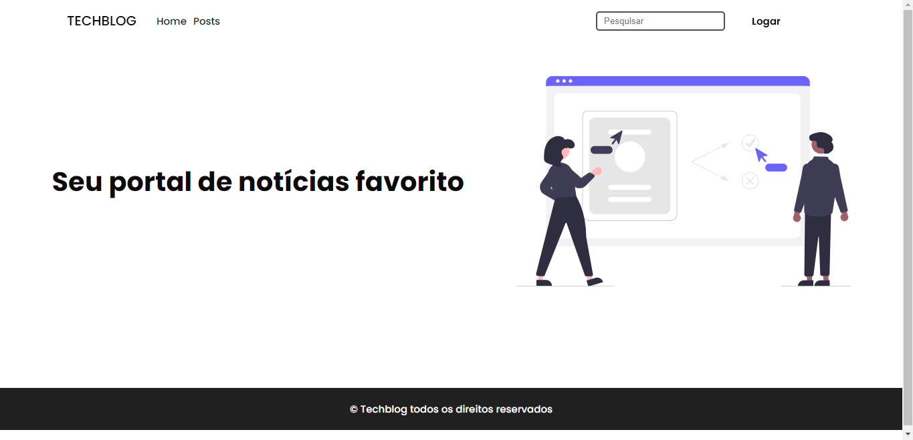
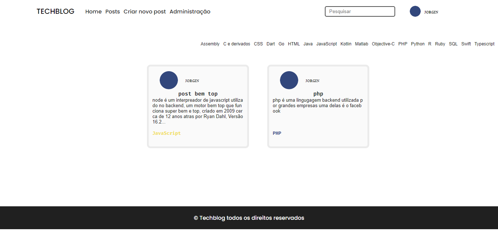
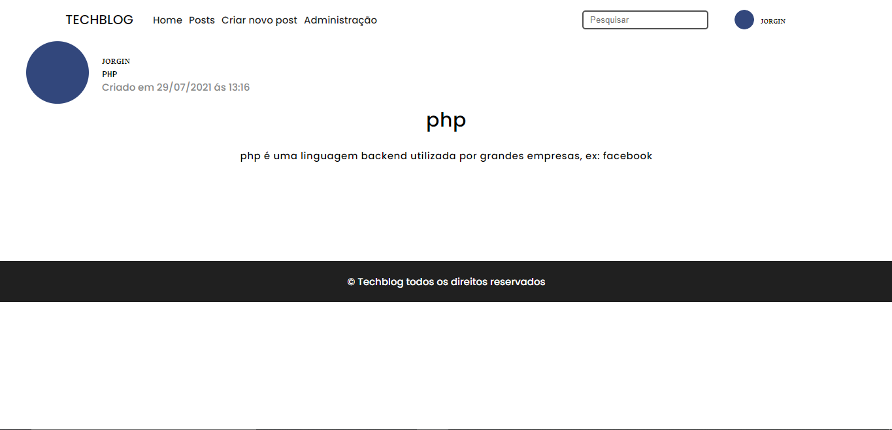

# TechBlog

Neste blog você encontra artigos sobre muitas linguagens de tecnologia

<br>

[](https://github.com/jorge933/blog/blob/master/LICENSE)

## Screenshots

### Não logado


### Logado sendo administrador (Criar novo post pode mudar, caso o usuario não tenha permissão para criar posts)


### Varios posts


### Um unico post


## Tecnologias usadas
- EJS
- CSS
- Javascript
- Node
- sqlite3


## Otimizações
Nos testes de velocidade do google a velocidade do site ficou entre 98, 99 no desktop, ja no mobile 94, 95


## Licença

[GNU General Public License v3.0.](https://choosealicense.com/licenses/gpl-3.0/)


## Instalar o projeto na sua maquina

```bash
  git clone https://github.com/jorge933/blog.git
  cd blog
  npm install
  npm run init-db
```

crie um arquivo .env e o ajuste como o .env example
```bash
  npm start
```

Depois disso acesse http://localhost:5000/

## Features a serem adicionas

- Responsividade
- Perfil

## Feedback

Caso você tenha algum elogio ou critica, envie no meu instagram: @jorgin_p ou no meu discord Jorgin#2177

## Design

 - [Design inspirado em alguns vídeos no youtube](https://youtu.be/KU-YFl4iU90)
 - [Vídeo 2](https://youtu.be/dj5_vEACQaY)
 - [Vídeo 3](https://youtu.be/360AvdGDVHE)

**Dependendo do tamanho do seu monitor o projeto pode não funcionar corretamente, ja que não esta responsivo e o foco do projeto não era CSS.**

**Algumas funções podem não estar disponiveis, devido a estar em desenvolvimento**
